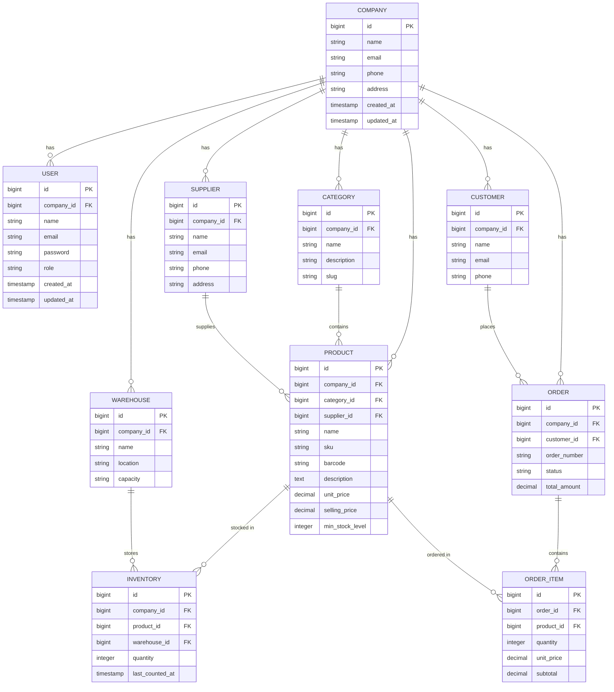

<div align="center">
  
</div>

# StockSync - Inventory Management System

StockSync is a modern, high-performance Inventory Management System (IMS) designed for multi-tenant businesses. It features a stunning, fully responsive Single Page Application (SPA) interface with a robust backend architecture.

<div align="left">
  
  
  
  
  
</div>

<br>

---

## Features & Implementation Status

### Core Architecture
- [x] **Inertia.js SPA:** Lightning-fast page transitions without full page reloads, retaining the simplicity of server-side routing.
- [x] **Multi-Tenancy:** Built-in `TenantScope` ensuring data isolation across different organizations using a global `company_id` scope.
- [x] **Role-Based Access Control (RBAC):** Integrated Spatie permissions system to seamlessly manage access levels (e.g., Super Admin, Company Admin, Manager, Staff).
- [x] **Multi-Tenancy Enforcement:** Automatically inject the `company_id` into models upon creation via Model Observers or Traits.

### Premium UI/UX Design
- [x] **Dark Mode Support:** First-class dark mode implementation across all components with subtle glassmorphism effects and tailored color palettes.
- [x] **Custom Components:** Reusable, headless-UI inspired components like `<Dropdown>`, `<Modal>`, and interactive tables.
- [x] **Responsive Layouts:** A mobile-first sidebar and navigation structure that scales perfectly to desktop environments.

### Application Modules
- [x] **Catalog & Inventory (UI):** Manage Products, Categories, and Warehouse locations visually.
- [x] **Financials & Transactions (UI):** Interfaces for Sales, Purchases, Orders, and Payments.
- [x] **Stakeholders (UI):** Dedicated CRM-lite views for Suppliers and Customers.
- [x] **Administration (UI):** Settings panels, Role management, and Audit Logs.
- [ ] **Database Schema & Migrations:** Define exact table structures, foreign keys, and indexes for Products, Sales, Purchases, etc.
- [ ] **Backend CRUD Controllers:** Wire up the UI to perform actual database mutations (Create, Read, Update, Delete) via Laravel Controllers.
- [x] **Form Validation:** Implement strict server-side validation using Laravel FormRequests for all data entries.
- [ ] **Dashboard Analytics:** Build complex Eloquent queries to aggregate real-time data for the Dashboard charts and metric cards.
- [x] **File Uploads & Exporting:** Wire up CSV/Excel parsing for bulk product imports, and implement PDF generation for invoices/receipts.
- [ ] **Production Optimization:** Configure Vite for production builds, set up Redis caching for queries, and configure server deployments.

---

## Complete Database Schema (Proposed)

The following schema represents the complete multi-tenant database structure that powers StockSync. All tables (except the core Companies table) are scoped by `company_id`.



---

## Getting Started (Local Development)

1. Clone the repository and install dependencies:
   ```bash
   composer install
   npm install
   ```

2. Copy the `.env` file and generate an application key:
   ```bash
   cp .env.example .env
   php artisan key:generate
   ```

3. Run migrations and seed the database (includes roles and super-admin):
   ```bash
   php artisan migrate:fresh --seed
   ```

4. Start the local development servers:
   ```bash
   # Terminal 1 (Backend)
   php artisan serve

   # Terminal 2 (Frontend HMR)
   npm run dev
   ```
